## 前端部分

本次项目的前端部分基于开源项目开发，采用了vue2技术框架，并且实现了前后端分离开发，提升了开发效率。

### 技术栈

前端部分使用了以下技术和框架：

- Element-ui：用于构建用户界面。
- v-chart：用于可视化图表的绘制。
- vue2：用于处理用户交互和页面操作。
- 技术栈基于 [ES2015+](http://es6.ruanyifeng.com/)、[vue](https://cn.vuejs.org/index.html)、[vuex](https://vuex.vuejs.org/zh-cn/)、[vue-router](https://router.vuejs.org/zh-cn/) 、[axios](https://github.com/axios/axios) 和 [element-ui](https://github.com/ElemeFE/element)

### 页面布局与可视化

前端页面呈现了直观的可视化图形，并具备一定的美观度。图表和数据展示采用了交互式和响应式设计，使用户能够轻松地浏览和操作数据。

### 数据分析与可视化

### Answers

#### 问题 1: 没有答案的问题的百分比

我们展示了没有答案的问题的百分比。这有助于了解问题的回答情况和潜在的需求缺口。

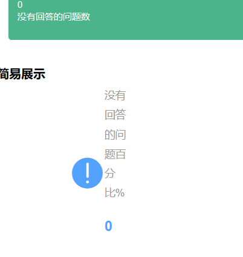

#### 问题 2: Answer 数量的平均值和最大值

我们展示了 Answer 数量的平均值和最大值。这有助于了解问题的回答活跃程度和热门问题的答案数量。

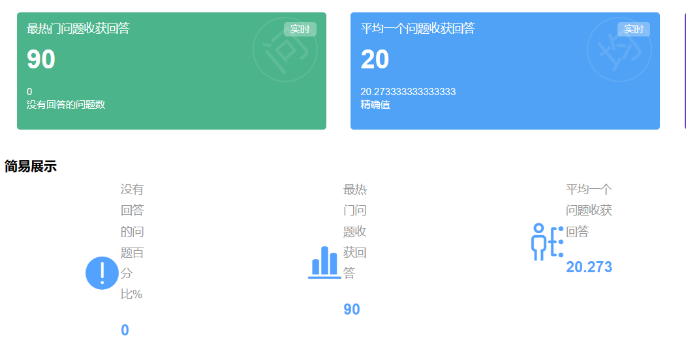

#### 问题 3: Answer 数的分布

我们展示了 Answer 数的分布情况，并使用直方图进行可视化。这有助于了解不同问题的回答数量范围和分布情况。

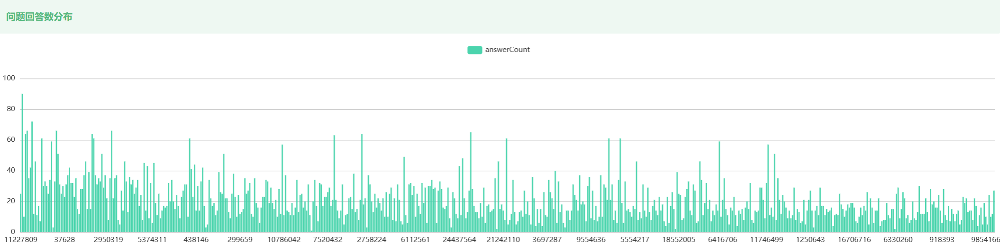

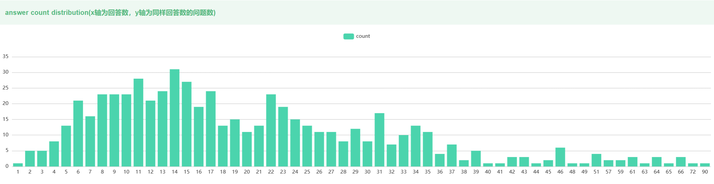

#### 问题 4: 有 Accepted Answer 的问题的百分比

我们展示了有 Accepted Answer 的问题的百分比，并使用饼图进行可视化。这有助于了解问题的解决程度和回答质量。

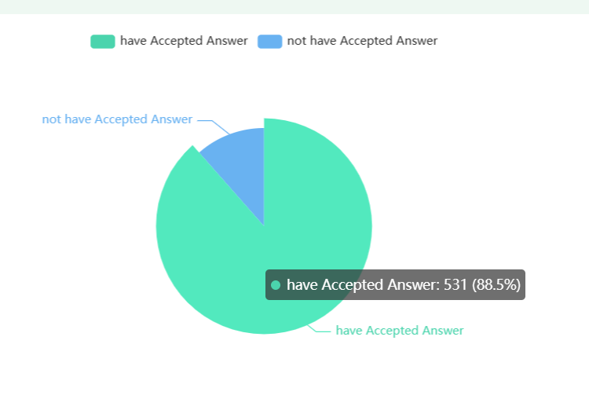

#### 问题 5: 问题的解决时间间隔分布

我们展示了问题从提出到解决的时间间隔分布，并使用区间图进行可视化。这有助于了解问题的解决效率和解决时间的分布情况。

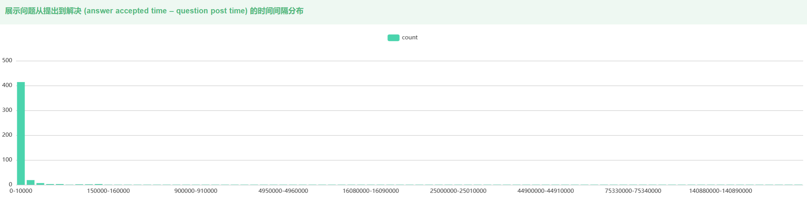

#### 问题 6: 含有非 Accepted Answer 的 Upvote 数高于 Accepted Answer 的问题的百分比

我们展示了含有非 Accepted Answer 的 Upvote 数高于 Accepted Answer 的问题的百分比，并使用饼图进行可视化。这有助于了解回答质量和社区对于不同答案的评价。

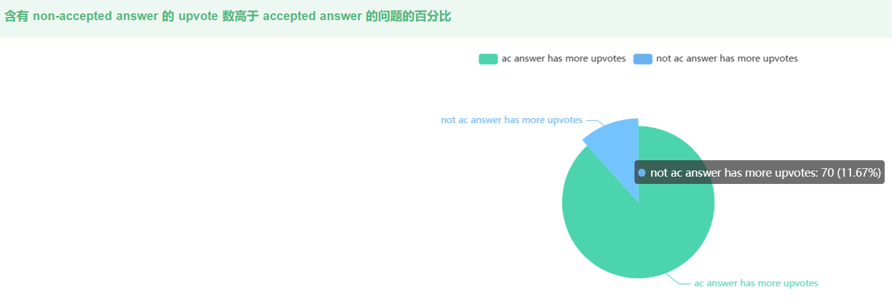

### Tags

#### 问题7: 经常和 Java tag 一起出现的 tags

我们展示了经常和 Java tag 一起出现的 tags，并使用柱状图进行可视化。这有助于了解 Java 相关问题的关联标签，以及在 Java 社区中讨论的其他相关技术和主题。

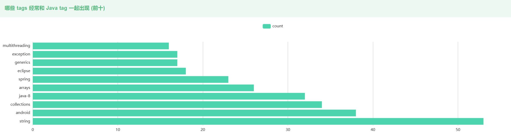

#### 问题8: 得到最多 upvotes 的 tags 或 tag 组合

我们展示了得到最多 upvotes 的 tags 或 tag 组合，并使用柱状图进行可视化。这有助于了解在 Stack Overflow 上受欢迎的标签和话题，以及用户对这些问题的兴趣和评价。

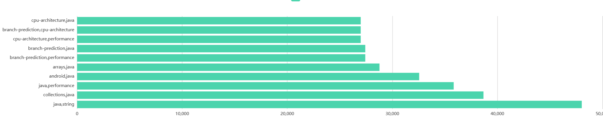

#### 问题9: 得到最多 views 的 tags 或 tag 组合

我们展示了得到最多 views 的 tags 或 tag 组合，并使用柱状图进行可视化。这有助于了解在 Stack Overflow 上最受关注和浏览的标签和话题，以及用户对这些问题的关注度。

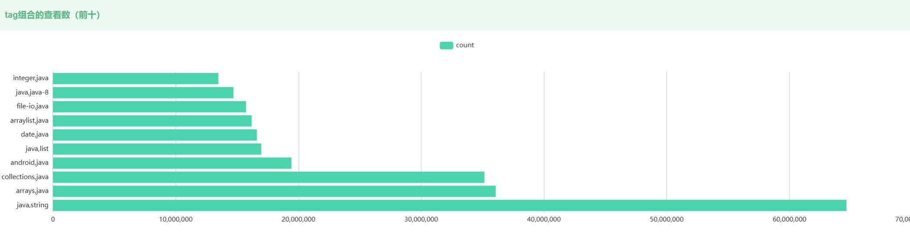

### Users

#### 问题10: 参与 Thread 讨论的用户数量的分布

我们展示了参与 Thread 讨论的用户数量的分布，并使用直方图进行可视化。这有助于了解不同 Thread 讨论的参与度和活跃程度，以及社区中用户的贡献程度。并且从问题回答者和评论者两个角度进行统计，展示了参与 Thread 讨论的用户数量和分布情况。这有助于了解回答问题和发表评论的用户群体，以及他们在社区中的活跃程度。

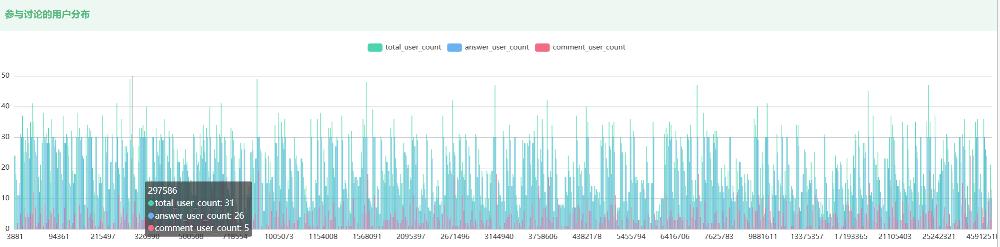

#### 问题11: 参与 Java Thread 讨论最活跃的用户

我们展示了参与 Java Thread 讨论最活跃的用户，并使用柱状图进行可视化。这有助于了解在 Java Thread 相关问题上最积极参与讨论的用户，以及他们在社区中的贡献和影响力。

通过对这些问题的数据分析和可视化，我们可以获得关于标签关联性、热门标签、用户参与度和活跃用户等方面的洞察。这些洞察有助于了解社区的兴趣和话题，评估用户的参与度，并为用户提供更有针对性的内容和互动。

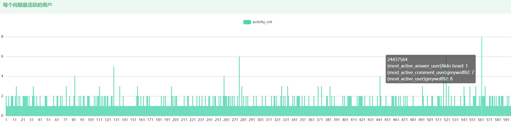

### Insight：

前端部分：

前后端分离是一种现代软件开发中常用的软件架构模式，将前端和后端的开发分离，使它们成为独立的系统。前后端分离的几个好处：

1. **灵活性和可扩展性**：前后端分离使前端和后端可以独立进行开发和部署。这样，团队可以根据需求独立扩展和调整前端和后端的功能，而无需影响彼此。

2. **并行开发**：前后端分离允许前端和后端团队并行开发，提高开发效率。前端开发人员可以专注于用户界面和用户体验，而后端开发人员可以专注于业务逻辑和数据处理。这种并行开发减少了项目的交付时间。

3. **技术栈多样性**：前后端分离允许前端和后端使用不同的技术栈和工具。前端可以选择适合他们需求的前端框架和库，后端可以选择适合他们需求的后端语言和框架。这样，团队可以根据自身技术能力和项目需求做出最佳选择。

4. **可重用性和维护性**：前后端分离通过明确定义 API 接口来实现前后端之间的通信。这样，前端和后端可以独立进行开发和维护。同时，API 接口的可重用性也提高了代码的维护性和可测试性。

5. **更好的团队协作**：前后端分离促进了团队之间的协作和沟通。前端和后端团队可以独立合作，减少了彼此之间的依赖。通过明确的接口定义和规范，团队之间的沟通变得更加清晰和高效。

总的来说，前后端分离可以提供更好的灵活性、可扩展性、并行开发、技术栈多样性、可重用性和维护性，以及更好的团队协作。这大大提升了我们团队的合作效率。

参考开源项目：

[mgbq/nx-admin: 👍 A magical 🐮 ⚔ vue admin，记得star (github.com)](https://github.com/mgbq/nx-admin)